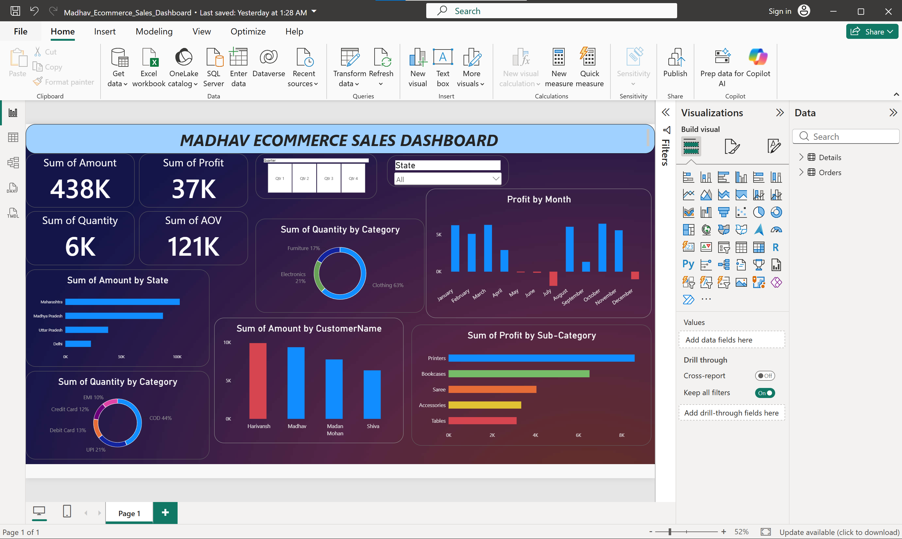

# Madhav Ecommerce Sales Dashboard

## Project Overview
This project is an interactive Power BI dashboard created to analyze e-commerce sales performance and identify key business insights.

## Key Analysis
- Total Sales
- Total Profit
- Total Quantity
- Average Order Value
- Sales by State
- Profit by Month
- Sales by Category
- Profit by Sub-Category
- Customer-wise Sales

## Tools Used
- Power BI

## Dashboard Preview

# Madhav Ecommerce Sales Dashboard
